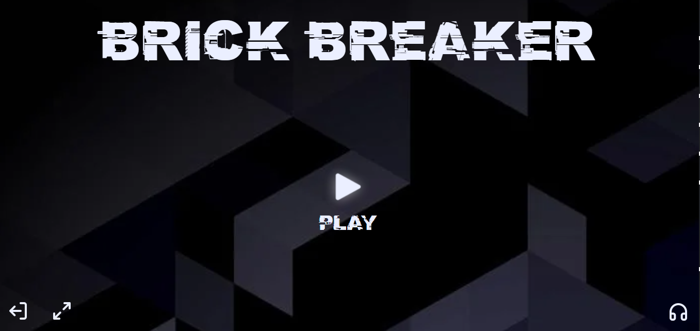
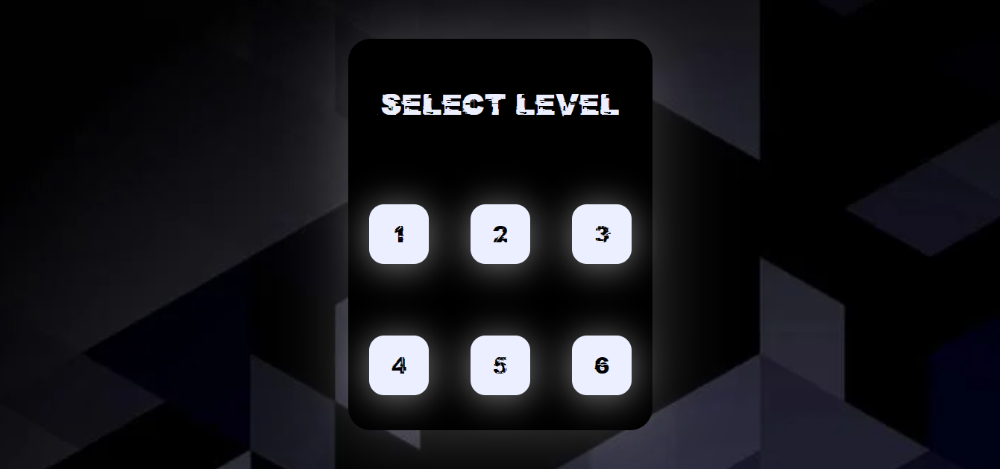
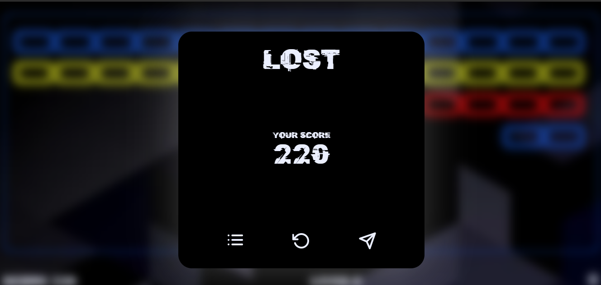
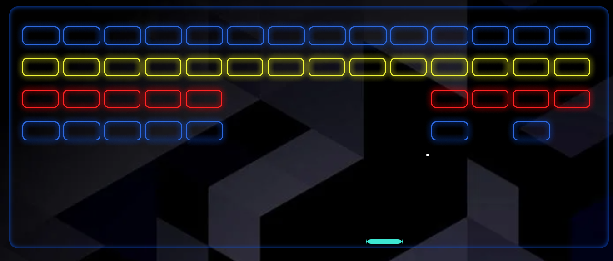

# Brick-breaker 🧱

## 👨🏻‍💻👩🏻‍💻 Introduction

 <strong> Game is designed for Devsnest First Ever Hackathon </strong>

 

<strong>♥ Team Undefined ♥</strong>

    

 

## 🧠 About Game

We want to make an interactive game based upon the classic game brick breaker. The object of brick breaker is to break the bricks that are distributed around the top of the game screen. The bricks get broken after coming in contact with a ball that bounces around the screen. At the bottom is a paddle that in the classic game moves based on user input. 

 

The user has to make sure the ball bounces off the paddle without going off the bottom of the screen. In our implementation, we want to make the paddle be based upon the position of an actual Ping-Pong paddle held by the user. The paddle moves as user moves his mouse cursor

 

### Preview Deployed Game

<a href="https://undefined-brickbreaker.netlify.app/">🎮 Play Game 🎮</a>

 

## 🎮Game Panel

<strong ><code>Landing Page</code></strong>

<strong>Levels of Game</strong>

<strong>When users losses the game</strong>

<strong>Brick structure ( User experience )</strong>

 

### 📍 Game Play

<h1><code> Game Play </code></h1>

 

## 📌 TechStack

<ul>
    <li><strong>🗡 Landing Page</strong>
    <ul>
        <li>HTML</li>
        <li>CSS</li>
    </ul>
    </li>
    <li><strong>🗡 Game Logic</strong>
    <ul>
        <li>Javascript</li>
        <li>Canvas</li>
    </ul>
    </li>
</ul>

 

## 📌 Contribution
 

 
Contribution to this repos are always welcome. You can always upgrade the UI, or fix any bug predefined in the issue section.

 

    1. Open a new issue describing the feature. 
    2. Add feature tag to this issue. 
    3. Get acceptance from the code maintainers. 
    3. Enjoy adding the feature 

